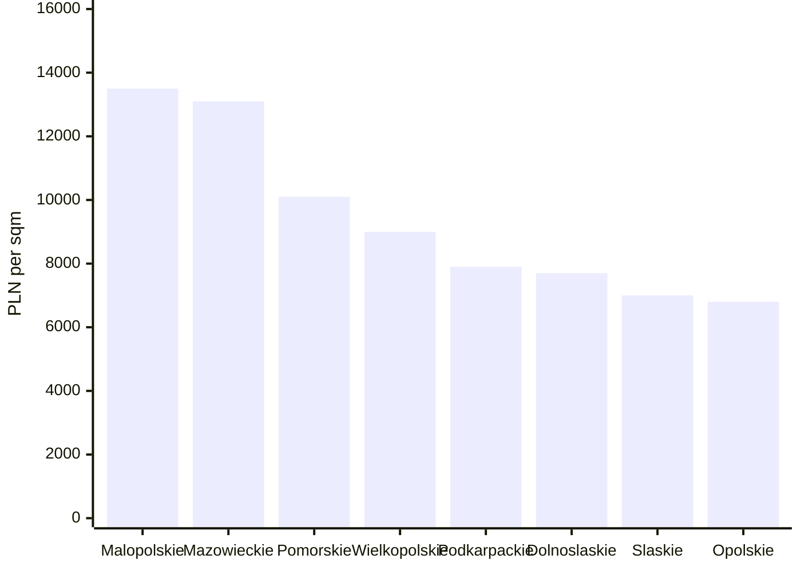

# Polish Real Estate Price Aggregates

[](https://github.com/bi3lu/polish-real-estate-price-aggregates/actions/workflows/ci.yml)


Python data pipeline for collecting, normalizing, aggregating, and publishing
analysis-ready Polish residential real estate listing data.

The project reads listing data from one of the popular real estate advertising
services in Poland, stores raw records in a bronze layer, transforms them into a
clean silver dataset, builds gold analytical tables, and exports an anonymized
public dataset suitable for exploratory analysis and machine-learning
experiments.

The repository intentionally does not include source-service branding in the
documentation. To run the ingestion command, provide the appropriate listing and detail
base URLs for the supported service in your local `.env` file.

## Portfolio Highlights

- End-to-end data engineering pipeline with bronze, silver, gold, and public
  data layers.
- Offline demo mode that runs the full ETL flow from local fixture records
  without requiring source-service configuration.
- Resumable listing ingestion with duplicate detection and page checkpoints.
- Typed Pydantic models and strict static analysis with `mypy`.
- Feature engineering, aggregate tables, and data quality outputs for analytics
  and ML workflows.
- Privacy-aware public dataset export with location generalization, rounded
  targets, attribution, and Git LFS tracking.
- CI coverage for linting, formatting, type checks, and tests.

## What This Project Produces

The pipeline writes data into four layers:

| Layer | Location | Purpose |
| --- | --- | --- |
| Bronze | `data/bronze/` | Raw ingested listing snapshots and resume checkpoints. |
| Silver | `data/silver/` | Flat, normalized listing records with validated types. |
| Gold | `data/gold/` | ML-ready features, geographic aggregates, segment aggregates, and data quality metrics. |
| Public | `data/public/` | Anonymized public CSV exports with sensitive fields removed or generalized. |

The public dataset is documented separately in
[`data/public/README.md`](data/public/README.md).

Architecture and UML-style diagrams are available in [`docs/`](docs/README.md).

## Example Insights

The current public export contains 49,047 anonymized listings from selected
voivodeships. It is a regional sample rather than a complete national market
dataset, but it is large enough to demonstrate the analytical outputs produced
by the pipeline.

Example findings from the published public dataset:

- Malopolskie and Mazowieckie have the highest median public price per square
  meter in the sample, at about 13,500 PLN/sqm and 13,100 PLN/sqm respectively.
- Apartments are priced much higher per square meter than houses in the sample:
  median public price per square meter is about 12,200 PLN/sqm for apartments
  versus 6,900 PLN/sqm for houses.
- Studio apartments have the highest median price density at about
  13,900 PLN/sqm, which is consistent with smaller units carrying a higher
  price per square meter.
- The public export keeps 98.93% of price targets, exposes public city labels
  for 76.50% of records, and exposes generalized coordinate-grid locations for
  12.52% of records after privacy filtering.

Median public price per square meter by voivodeship:



Segment-level comparison:

| Segment | Records | Median public price per sqm |
| --- | ---: | ---: |
| Studio apartments | 7,303 | 13,900 PLN |
| Apartments | 20,363 | 12,200 PLN |
| Houses | 21,381 | 6,900 PLN |

Public dataset coverage summary:

| Metric | Value |
| --- | ---: |
| Public records | 49,047 |
| Records with public price target | 98.93% |
| Records with public city | 76.50% |
| Records with generalized geo grid | 12.52% |
| Distinct public cities | 415 |

Sample public rows:

| Estate type | Voivodeship | Public city | Area bucket | Price bucket | Public target price per sqm |
| --- | --- | --- | --- | --- | ---: |
| `dom` | `dolnoslaskie` | `Wrocław` | `gte_150` | `gte_1_5m` | 11,800 PLN |
| `dom` | `dolnoslaskie` | suppressed | `gte_150` | `gte_1_5m` | 7,400 PLN |
| `mieszkanie` | `opolskie` | suppressed | `lt_35` | `lt_300k` | 3,900 PLN |

The same outputs can be used for ranking local markets, comparing property
segments, auditing missingness, preparing ML features, or publishing a
privacy-aware dataset without exposing listing-level source identifiers.

## Features

- CLI-based ingestion with configurable estate types, voivodeships, page limits,
  and worker threads.
- Resume support based on existing bronze external ids and page checkpoints.
- Bronze JSONL storage split by voivodeship.
- Bronze-to-silver normalization with Pydantic validation.
- Silver-to-gold feature engineering and aggregate tables.
- Gold-to-public anonymization with location suppression, rounded price targets,
  and bucketed attributes.
- Data quality exports for gold and public layers.
- Type checking and test coverage through `mypy`, `ruff`, `black`, `isort`, and
  `pytest`.

## Requirements

- Python 3.10 or newer.
- `uv` for dependency management.
- Git LFS if you want to version public CSV datasets from `data/public`.

Install `uv` using the official instructions for your operating system, then
install project dependencies with:

```bash
uv sync --dev
```

If you plan to work with public CSV files tracked by Git LFS:

```bash
git lfs install
git lfs pull
```

## Configuration

Create a local `.env` file in the repository root:

```bash
cp .env.example .env
```

Then fill in the source-service URLs:

```dotenv
MAIN_URL="https://example.com/path/to/search/results/"
ESTATE_URL="https://example.com/path/to/listing/details/"
```

`MAIN_URL` should point to the base search/listing-results URL of the supported
Polish real estate advertising service. `ESTATE_URL` should point to the base
listing-detail URL used to normalize relative listing links.

The `.env` file is intentionally ignored by Git. Do not commit credentials,
private URLs, or local configuration.

## Quick Start

Install dependencies:

```bash
uv sync --dev
```

Run the offline demo pipeline without configuring `.env` or contacting the
source service:

```bash
uv run python -m src.etl.demo
```

The demo writes deterministic fixture-based outputs under `data/demo/` for all
pipeline layers: bronze, silver, gold, and public. This is the fastest way to
review the project flow in a fresh checkout.

Run a small ingestion job for one estate type and one voivodeship:

```bash
uv run python main.py \
  --estate-type mieszkanie \
  --voivodeship mazowieckie \
  --max-page 2 \
  --workers 1 \
  --pretty
```

Run the full configured ingestion:

```bash
uv run python main.py
```

The command prints a JSON summary containing the output path and number of newly
written records.

## CLI Options

```bash
uv run python main.py --help
```

Common options:

| Option | Description |
| --- | --- |
| `--estate-type`, `-t` | Estate type slug. Can be repeated or passed as comma-separated values. |
| `--voivodeship`, `-v` | Voivodeship slug. Can be repeated or passed as comma-separated values. |
| `--max-page` | Maximum page to process per estate type and voivodeship combination. |
| `--workers`, `--threads` | Number of worker threads used across ingestion targets. |
| `--pretty` | Pretty-print the JSON command output. |

Configured estate types:

- `mieszkanie`
- `dom`
- `kawalerka`

Configured voivodeships are defined in `src/config/globals.py`.

## Offline Demo Pipeline

For reviewers who only want to inspect the ETL flow, the project includes a
fully local demo mode:

```bash
uv run python -m src.etl.demo
```

The command uses a small built-in fixture dataset and writes:

| Layer | Demo output |
| --- | --- |
| Bronze | `data/demo/bronze/` |
| Silver | `data/demo/silver/` |
| Gold | `data/demo/gold/` |
| Public | `data/demo/public/` |

The demo intentionally bypasses ingestion and does not read `.env`, call the
source service, or require network access. Its purpose is to make the pipeline
reviewable in seconds while keeping real collection configuration private and
optional.

## Running the ETL Pipeline

After a bronze snapshot exists, run the ETL stages in order.

Bronze to silver:

```bash
uv run python -m src.etl.silver
```

Silver to gold:

```bash
uv run python -m src.etl.gold
```

Gold to public:

```bash
uv run python -m src.etl.public
```

Each stage selects the latest input snapshot from the previous layer by default
and writes timestamped CSV outputs to the next layer.

## Repository Layout

```text
.
├── main.py
├── src/
│   ├── config/          # Environment loading and global constants
│   ├── etl/             # Bronze, silver, gold, and public ETL stages
│   ├── models/          # Pydantic models for each data layer
│   ├── ingestion/       # Listing ingestion and parsing logic
│   └── utils/           # CLI, logging, and storage helpers
├── tests/               # Unit tests
├── data/
│   ├── bronze/
│   ├── silver/
│   ├── gold/
│   └── public/
└── .github/workflows/   # CI configuration
```

## Development

Run tests:

```bash
uv run pytest
```

Run linting and formatting checks:

```bash
uv run ruff check .
uv run black --check .
uv run isort --check-only .
uv run mypy .
```

Format code locally:

```bash
uv run black .
uv run isort .
```

## Development Workflow

The project was developed incrementally using feature branches and GitHub pull
requests. Each milestone focused on a distinct layer of the data engineering
workflow, and the finished work was merged into `main` with squash commits to
keep the production history concise while preserving the pull request history as
a readable record of the project's evolution.

This workflow makes the repository easier to review in two complementary ways:
`main` shows a clean release-oriented history, while the pull requests show how
the implementation was planned, reviewed, and expanded over time.

Key development milestones:

- [#2](https://github.com/bi3lu/polish-real-estate-price-aggregates/pull/2) introduced the estate scraper, bronze-layer parsing, core data models,
  environment configuration, CLI entry point, and initial tests.
- [#3](https://github.com/bi3lu/polish-real-estate-price-aggregates/pull/3) added the silver ETL layer, threaded ingestion, normalized storage helpers,
  duplicate handling, and broader test coverage.
- [#4](https://github.com/bi3lu/polish-real-estate-price-aggregates/pull/4) added the gold ETL layer, analytical aggregates, checkpointing, improved CLI
  controls, public dataset preparation, and CI refinements.
- [#5](https://github.com/bi3lu/polish-real-estate-price-aggregates/pull/5) finalized documentation, public dataset metadata, repository cleanup, and
  presentation polish before merging the completed development branch into
  `main`.

The branch and pull request history therefore documents the full path from an
initial scraper prototype to a typed, tested, CI-backed data pipeline with
bronze, silver, gold, and public export layers.

## Continuous Integration

GitHub Actions CI is split into two jobs:

- `linter`: runs Ruff, Black check, isort check, and mypy.
- `tests`: runs the pytest suite.

The workflow is defined in `.github/workflows/ci.yml`.

## Public Dataset and Git LFS

CSV files under `data/public/*.csv` are configured for Git LFS in
`.gitattributes`:

```text
data/public/*.csv filter=lfs diff=lfs merge=lfs -text
```

If you add new public CSV exports, make sure Git LFS is installed and the files
are staged after the LFS tracking rule is present:

```bash
git lfs install
git add .gitattributes data/public/*.csv
```

## Data Privacy Notes

The public export removes direct listing identifiers, URLs, seller identifiers,
street-level information, raw coordinates, and image URLs. It also suppresses or
generalizes location fields and rounds public price targets.

The current public dataset is not a complete dump of all listings in Poland. It
contains selected voivodeships only and should be treated as a regional sample,
not as an authoritative nationwide market dataset.

Before publishing regenerated public data, review the output schema and sample
rows to ensure no new sensitive or source-identifying fields were introduced.

## Limitations / Trade-offs

This project is intentionally built as a pragmatic data engineering pipeline,
not as an official market registry or guaranteed complete data source. The main
trade-offs are:

- The scraper depends on the HTML and embedded Next.js data shape exposed by the
  supported source service. If that structure changes, ingestion may need parser
  updates before new snapshots can be collected reliably.
- The dataset does not guarantee full coverage of the Polish residential real
  estate market. It contains listings that were reachable during configured
  ingestion runs for selected estate types and voivodeships.
- Resume checkpoints reduce unnecessary pagination and lower the chance of
  repeated blocked requests, but they can skip newly inserted listings that
  appear on pages before the saved checkpoint. Full refreshes should clear or
  reset checkpoint metadata intentionally.
- The public dataset is a privacy-filtered sample, not a lossless copy of the
  internal data. Some cities and coordinates are suppressed, numerical targets
  are rounded, and direct identifiers are removed by design.
- Ingestion should not be run aggressively. Use conservative worker counts,
  bounded page ranges, pauses between runs, and responsible retry behavior. The
  pipeline is designed for careful periodic collection, not high-pressure
  crawling.
- Analytical outputs should be treated as exploratory. They are useful for data
  quality monitoring, feature engineering, dashboards, and ML baselines, but not
  as authoritative valuation or investment advice.

## Disclaimer

This project is for data engineering, analytics, and educational use. Respect
the terms of the source service, applicable law, and responsible data handling
practices. The generated datasets should not be used as the sole basis for
legal, financial, valuation, or investment decisions.
