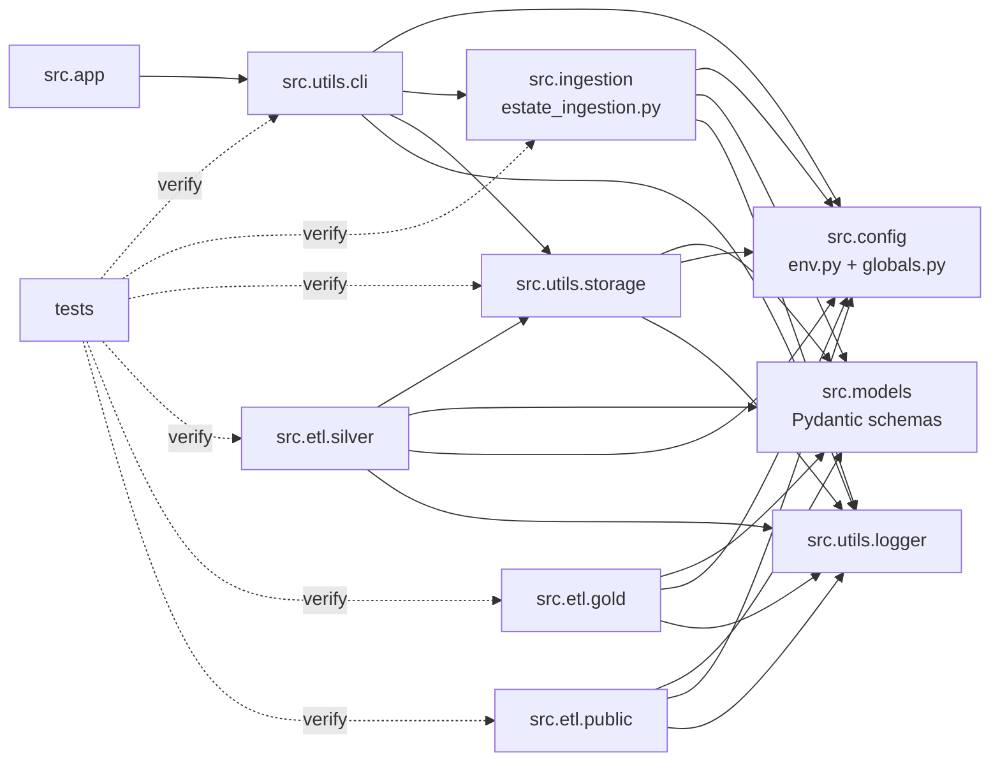

# Component Diagram

```mermaid
flowchart LR
    app[src.app]
    cli[src.utils.cli]
    config[src.config<br/>env.py + globals.py]
    ingestion[src.ingestion<br/>estate_ingestion.py]
    storage[src.utils.storage]
    logger[src.utils.logger]
    models[src.models<br/>Pydantic schemas]
    silver[src.etl.silver]
    gold[src.etl.gold]
    public[src.etl.public]
    tests[tests]

    app --> cli
    cli --> config
    cli --> ingestion
    cli --> storage
    cli --> logger

    ingestion --> config
    ingestion --> models
    ingestion --> logger

    storage --> models
    storage --> config
    storage --> logger

    silver --> storage
    silver --> models
    silver --> config
    silver --> logger

    gold --> models
    gold --> config
    gold --> logger

    public --> models
    public --> config
    public --> logger

    tests -. verify .-> cli
    tests -. verify .-> ingestion
    tests -. verify .-> storage
    tests -. verify .-> silver
    tests -. verify .-> gold
    tests -. verify .-> public
```

The project keeps source-specific ingestion, storage, ETL transformations, and
data models separated so each layer can be tested independently.
