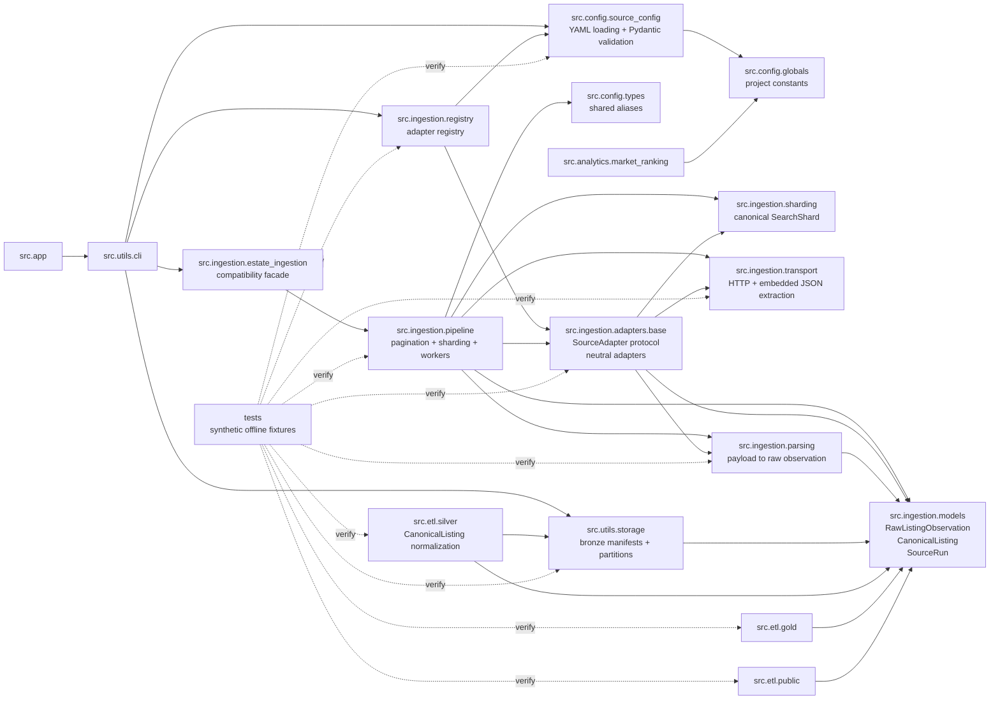

# Component Diagram

The ingestion layer is source-neutral. `registry.py` builds adapters from YAML
config, `adapters/base.py` provides reusable technical adapters, and
`pipeline.py` handles orchestration without knowing a real source brand.

Downstream private ETL consumes `CanonicalListing` records produced from neutral
`RawListingObservation` inputs. Public exports use a separate public schema.
