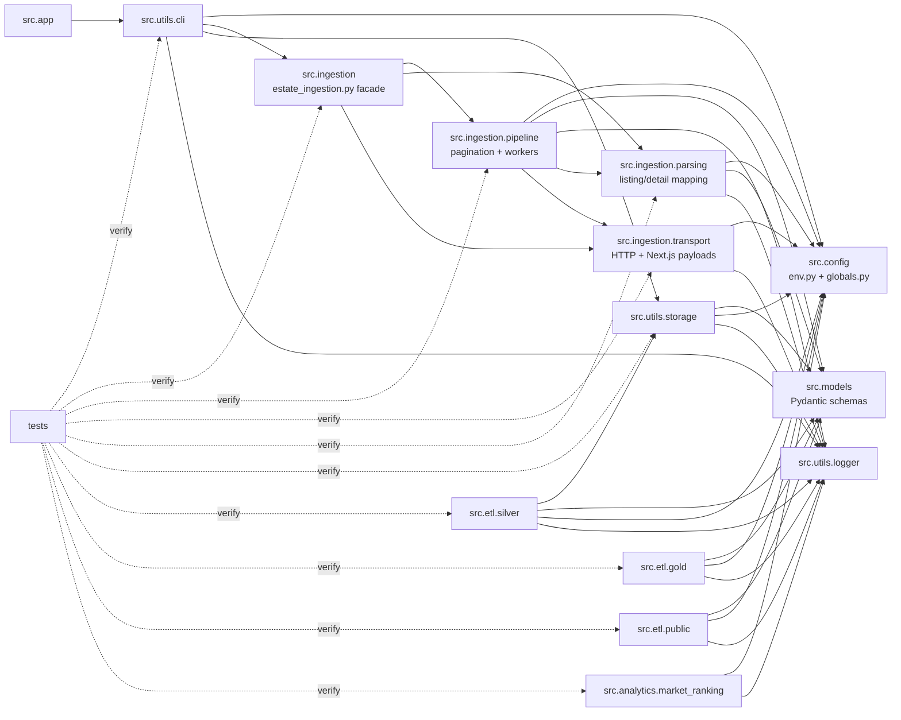

# Component Diagram

The ingestion package is split into focused modules: `transport` handles HTTP
and embedded Next.js payload extraction, `parsing` converts raw listing/detail
payloads into `Estate` models, and `pipeline` owns pagination, resume behavior,
and threaded streaming. `estate_ingestion.py` remains as a compatibility facade
for existing imports.

The project keeps source-specific ingestion, storage, ETL transformations, and
data models separated so each layer can be tested independently.
