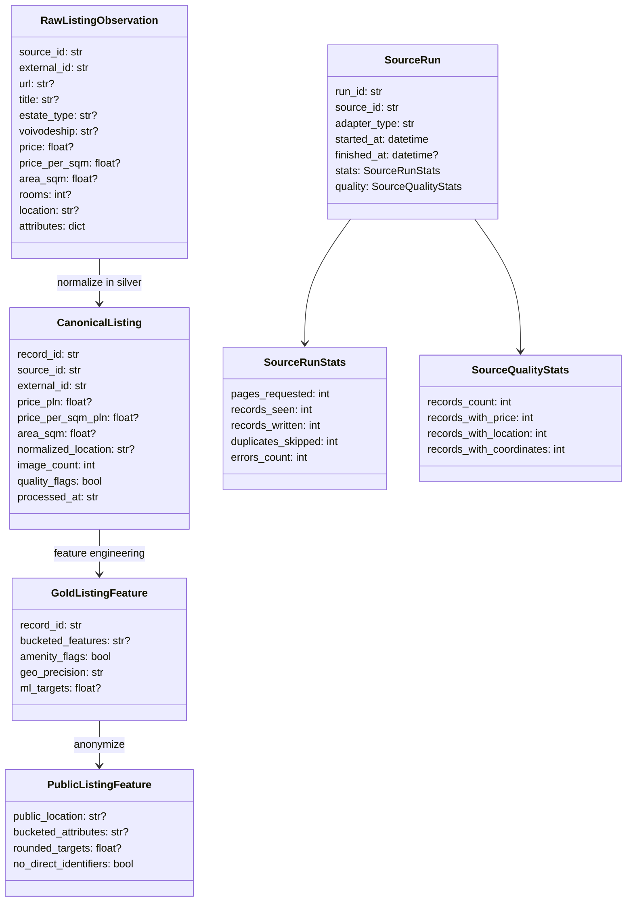

# Data Model Overview

Domain ingestion models live in `src/ingestion/models.py` and use neutral names.
They do not contain source-branded model names. Every record carries
`source_id`, but that id can be opaque and does not need to reveal the real
source.

`CanonicalListing` is private/internal. It can contain listing-level fields such
as URL, title, street, seller metadata, precise coordinates, and image-derived
fields because those are useful for private quality control and feature
engineering.

Public exports are a separate contract. They must never expose listing-level
identifiers, source identity, URL/title fields, seller identifiers, street-level
location, raw coordinates, image URLs, or raw source attributes.
