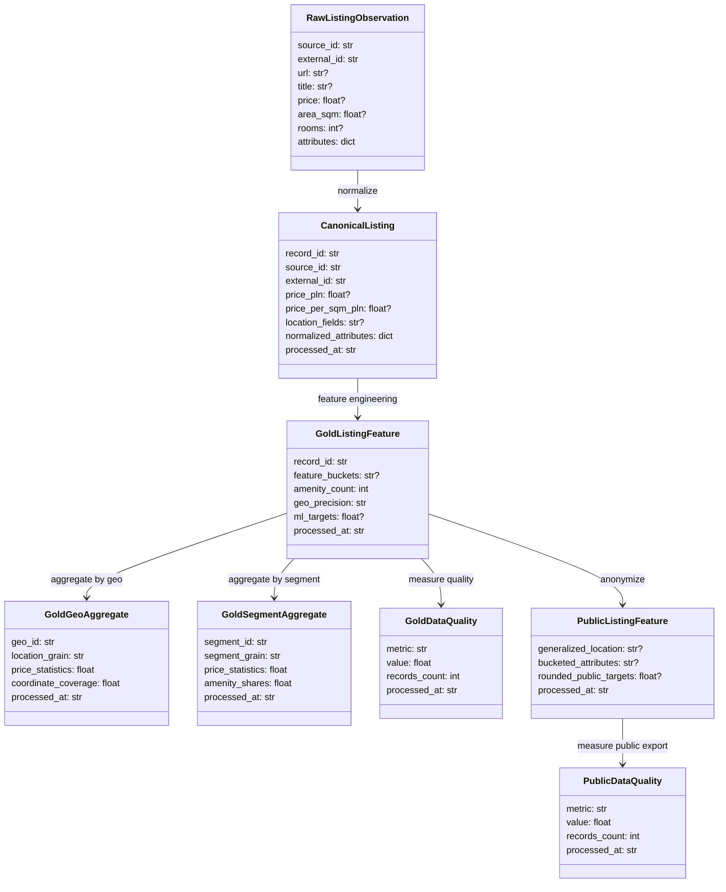

# Data Model Overview

```mermaid
classDiagram
    class RawListingObservation {
        source_id: str
        external_id: str
        url: str?
        title: str?
        price: float?
        area_sqm: float?
        rooms: int?
        attributes: dict
    }

    class CanonicalListing {
        record_id: str
        source_id: str
        external_id: str
        price_pln: float?
        price_per_sqm_pln: float?
        location_fields: str?
        normalized_attributes: dict
        processed_at: str
    }

    class GoldListingFeature {
        record_id: str
        feature_buckets: str?
        amenity_count: int
        geo_precision: str
        ml_targets: float?
        processed_at: str
    }

    class GoldGeoAggregate {
        geo_id: str
        location_grain: str
        price_statistics: float
        coordinate_coverage: float
        processed_at: str
    }

    class GoldSegmentAggregate {
        segment_id: str
        segment_grain: str
        price_statistics: float
        amenity_shares: float
        processed_at: str
    }

    class GoldDataQuality {
        metric: str
        value: float
        records_count: int
        processed_at: str
    }

    class PublicListingFeature {
        generalized_location: str?
        bucketed_attributes: str?
        rounded_public_targets: float?
        processed_at: str
    }

    class PublicDataQuality {
        metric: str
        value: float
        records_count: int
        processed_at: str
    }

    RawListingObservation --> CanonicalListing : normalize
    CanonicalListing --> GoldListingFeature : feature engineering
    GoldListingFeature --> GoldGeoAggregate : aggregate by geo
    GoldListingFeature --> GoldSegmentAggregate : aggregate by segment
    GoldListingFeature --> GoldDataQuality : measure quality
    GoldListingFeature --> PublicListingFeature : anonymize
    PublicListingFeature --> PublicDataQuality : measure public export
```

The public model intentionally omits direct listing identifiers, URLs, seller
identifiers, street-level information, raw coordinates, and image URLs.
