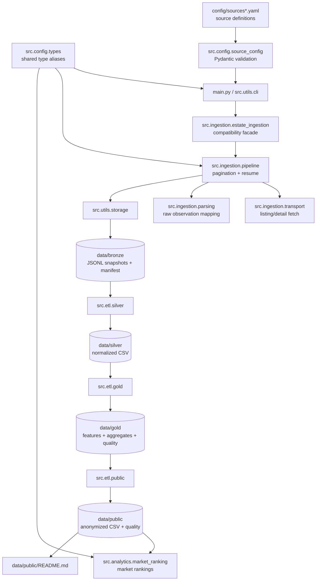

# Data Pipeline

The pipeline follows a layered data engineering pattern:

- `bronze`: raw ingested records and resume metadata.
- `silver`: normalized listing records with validated fields.
- `gold`: model-ready features, geographic aggregates, segment aggregates, and
  quality metrics.
- `public`: anonymized records designed for safe public analysis.
- `analytics`: command-line summaries and rankings derived from public data.

Ingestion is implemented as a small facade plus focused internal modules. The
facade preserves the historical import path, while `pipeline`, `transport`, and
`parsing` keep pagination, network fetching, and source-payload normalization
separate.

Shared type aliases are centralized in `src.config.types`, including ingestion
progress callbacks, search shard strategy names, market-ranking group/sort
options, and generic helper type variables used by ETL modules.
