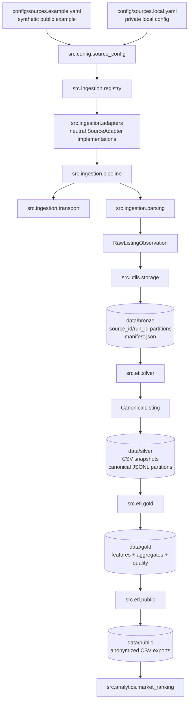

# Data Pipeline

Layer responsibilities:

- `bronze`: private raw observations partitioned by neutral `source_id` and
  per-source `run_id`, with manifests and resume checkpoint metadata.
- `silver`: normalized `CanonicalListing` records. The layer writes canonical
  JSONL partitions by `source_id` and month, plus CSV snapshots used by existing
  downstream ETL.
- `gold`: model-ready listing features, geographic aggregates, segment
  aggregates, and quality metrics.
- `public`: privacy-filtered CSV exports with direct identifiers removed.
- `analytics`: public-data ranking utilities that require no private data.

The repository ignores local bronze, silver, gold, and demo outputs.
