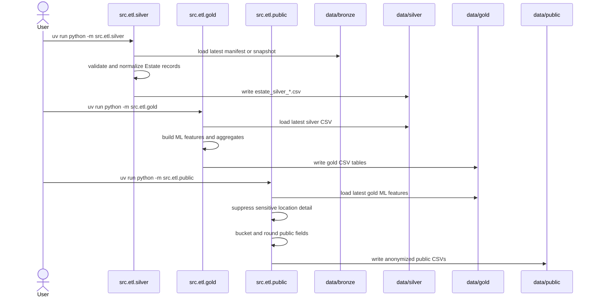

# ETL Sequence

```mermaid
sequenceDiagram
    actor User
    participant Silver as src.etl.silver
    participant Gold as src.etl.gold
    participant Public as src.etl.public
    participant BronzeData as data/bronze
    participant SilverData as data/silver
    participant GoldData as data/gold
    participant PublicData as data/public

    User->>Silver: uv run python -m src.etl.silver
    Silver->>BronzeData: load latest manifest or snapshot
    Silver->>Silver: validate and normalize Estate records
    Silver->>SilverData: write estate_silver_*.csv

    User->>Gold: uv run python -m src.etl.gold
    Gold->>SilverData: load latest silver CSV
    Gold->>Gold: build ML features and aggregates
    Gold->>GoldData: write gold CSV tables

    User->>Public: uv run python -m src.etl.public
    Public->>GoldData: load latest gold ML features
    Public->>Public: suppress sensitive location detail
    Public->>Public: bucket and round public fields
    Public->>PublicData: write anonymized public CSVs
```

Each ETL stage can be run independently. By default, each stage selects the
latest snapshot from the previous layer.
