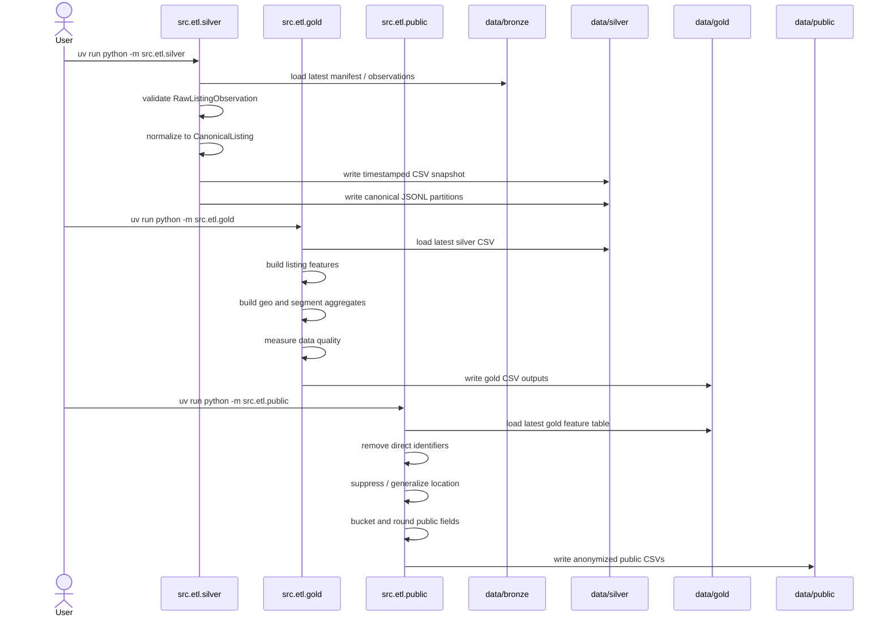

# ETL Sequence

Each ETL stage can be run independently. By default, each stage selects the
latest available input from the previous layer.

Silver is the semantic boundary between source observations and downstream
analytics. It emits `CanonicalListing`, and gold/public logic should remain
source-neutral.
