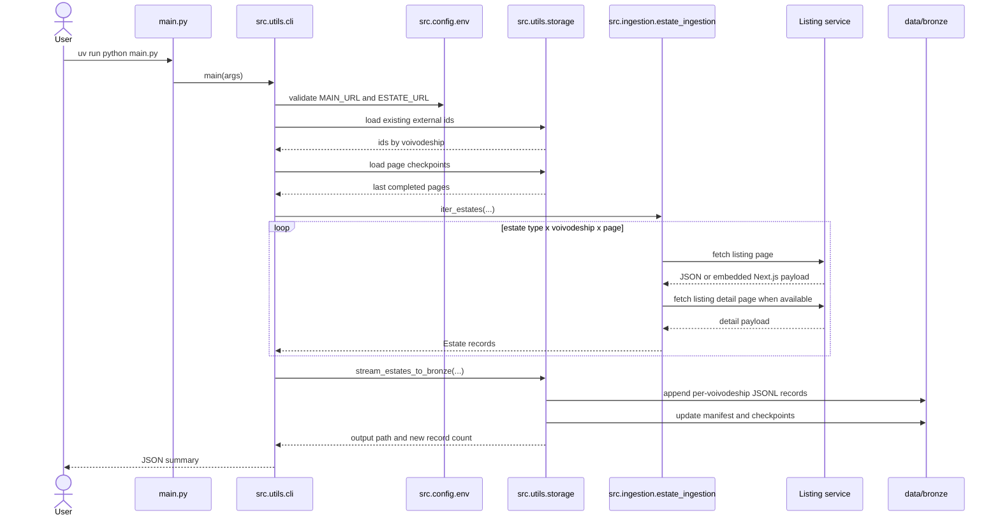

# Ingestion Sequence

```mermaid
sequenceDiagram
    actor User
    participant Main as main.py
    participant CLI as src.utils.cli
    participant Env as src.config.env
    participant Store as src.utils.storage
    participant Ingestion as src.ingestion.estate_ingestion
    participant Source as Listing service
    participant Bronze as data/bronze

    User->>Main: uv run python main.py
    Main->>CLI: main(args)
    CLI->>Env: validate MAIN_URL and ESTATE_URL
    CLI->>Store: load existing external ids
    Store-->>CLI: ids by voivodeship
    CLI->>Store: load page checkpoints
    Store-->>CLI: last completed pages
    CLI->>Ingestion: iter_estates(...)

    loop estate type x voivodeship x page
        Ingestion->>Source: fetch listing page
        Source-->>Ingestion: JSON or embedded Next.js payload
        Ingestion->>Source: fetch listing detail page when available
        Source-->>Ingestion: detail payload
        Ingestion-->>CLI: Estate records
    end

    CLI->>Store: stream_estates_to_bronze(...)
    Store->>Bronze: append per-voivodeship JSONL records
    Store->>Bronze: update manifest and checkpoints
    Store-->>CLI: output path and new record count
    CLI-->>User: JSON summary
```

The ingestion flow is resumable. Existing external ids prevent duplicate writes,
and page checkpoints allow later runs to continue from the last completed target.
