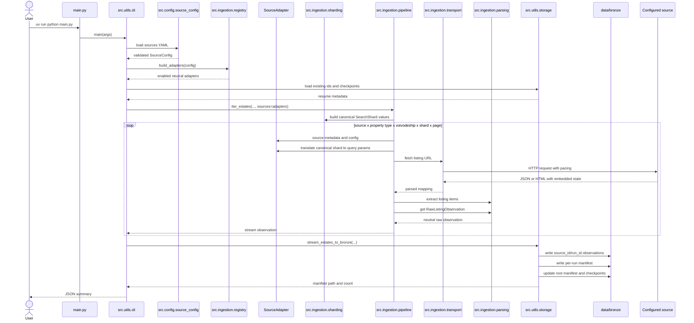

# Ingestion Sequence

## Resume Behavior

Ingestion is resumable:

- existing bronze ids prevent duplicate writes,
- page checkpoints track the last completed page per target,
- `--ignore-checkpoints` restarts selected targets from page 1 while still
  deduplicating existing records,
- repeated listing page signatures stop looping pagination,
- `--duplicate-page-stop-threshold` can stop refresh runs after repeated
  duplicate-only pages.

## Sharding

`--shard-strategy` can split broad searches into independent targets:

- `none`
- `price`
- `market-price`

Each shard has its own checkpoint key, which makes long collection runs easier
to resume.

Shard definitions are canonical. They carry values such as `price_to=300000` or
`market=primary`; adapter code translates them to source-specific URL query
parameters.

## Source-Specific Behavior Without Brand Classes

The pipeline receives `SourceAdapter` instances built from config. It uses
`source_id`, `adapter_type`, rate limits, page caps, and property type mappings,
but it does not need to know the real source name.

`html_listing_site` sources are parsed from listing pages and skip detail-page
enrichment by default when detail pages do not expose a stable embedded detail
object.
