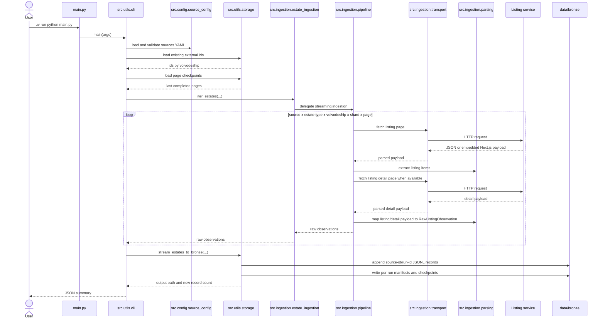

# Ingestion Sequence

The ingestion flow is resumable. Existing external ids prevent duplicate writes,
and page checkpoints allow later runs to continue from the last completed target.
The public import surface remains `src.ingestion.estate_ingestion`, but the
runtime work is delegated to smaller modules for transport, parsing, and
pagination/thread orchestration.

Pass `--ignore-checkpoints` to force selected targets to start from page 1 while
still deduplicating records already present in bronze storage. This is useful
for periodic refresh runs when new listings may have appeared before the saved
checkpoint.

Resume and refresh runs stop on duplicate-only pages only when explicitly
requested. The default threshold is `0`, which keeps scanning through
duplicate-only pages during backfills; tune it with
`--duplicate-page-stop-threshold` for smaller refresh windows. The pipeline
still stops when the source starts returning an already-seen listing page
signature, which protects against clamped or looping pagination.

Large source searches can be split with `--shard-strategy`. The CLI defaults to
`market-price`, creating independent market and price-range targets with their
own page checkpoints. This makes long regional runs easier to resume after a
403 or interruption and avoids relying on a single broad result set.

The transport layer treats `403` and `429` responses as source throttling. When
that happens it enters a shared cooldown, honors `Retry-After` when present, and
retries the blocked request with exponential backoff and jitter. The cooldown is
shared across worker threads, so one blocked request slows the whole scraper
instead of letting parallel workers keep hammering the source.
