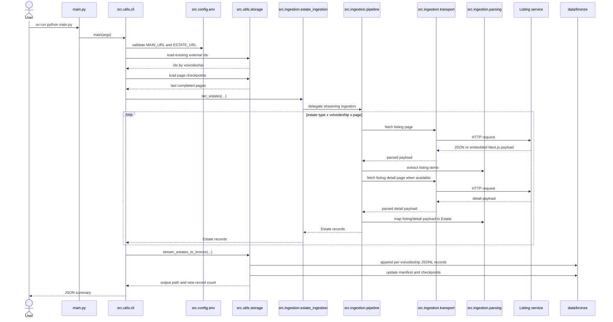

# Ingestion Sequence

The ingestion flow is resumable. Existing external ids prevent duplicate writes,
and page checkpoints allow later runs to continue from the last completed target.
The public import surface remains `src.ingestion.estate_ingestion`, but the
runtime work is delegated to smaller modules for transport, parsing, and
pagination/thread orchestration.
