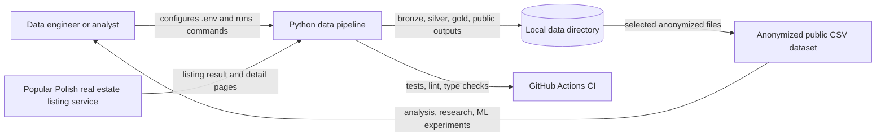

# System Context

```mermaid
flowchart LR
    user[Data engineer or analyst]
    source[Popular Polish real estate listing service]
    repo[Python data pipeline]
    local[(Local data directory)]
    public[Anonymized public CSV dataset]
    ci[GitHub Actions CI]

    user -->|configures .env and runs commands| repo
    source -->|listing result and detail pages| repo
    repo -->|bronze, silver, gold, public outputs| local
    local -->|selected anonymized files| public
    repo -->|tests, lint, type checks| ci

    public -->|analysis, research, ML experiments| user
```

The source service is intentionally described generically. Runtime URLs are
provided locally through `.env` and are not committed to the repository.
