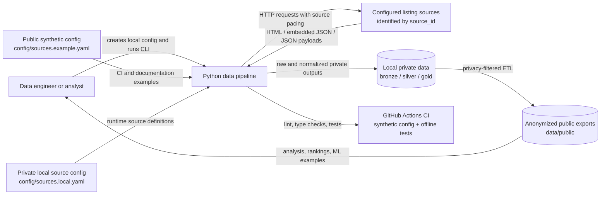

# System Context

```mermaid
flowchart LR
    user[Data engineer or analyst]
    local_config[Private local source config<br/>config/sources.local.yaml]
    example_config[Public synthetic config<br/>config/sources.example.yaml]
    sources[Configured listing sources<br/>identified by source_id]
    repo[Python data pipeline]
    private_data[(Local private data<br/>bronze / silver / gold)]
    public_data[(Anonymized public exports<br/>data/public)]
    ci[GitHub Actions CI<br/>synthetic config + offline tests]

    user -->|creates local config and runs CLI| repo
    example_config -->|CI and documentation examples| repo
    local_config -->|runtime source definitions| repo
    repo -->|HTTP requests with source pacing| sources
    sources -->|HTML / embedded JSON / JSON payloads| repo
    repo -->|raw and normalized private outputs| private_data
    private_data -->|privacy-filtered ETL| public_data
    public_data -->|analysis, rankings, ML examples| user
    repo -->|lint, type checks, tests| ci
```

The repository should not expose real source names, real source URLs, or raw
source payloads. Runtime sources are configured locally and stored by neutral
`source_id` values.
